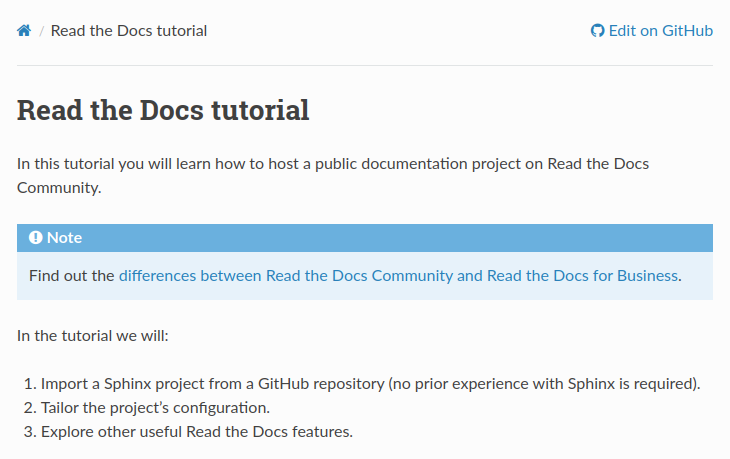

# Read-the-docs tutorial

Code from the below [readthedocs.io](https://docs.readthedocs.io/en/stable/tutorial/index.html)  tutorial on using Read the Docs and GitHub.

Built pages can be viewed from either:
 - [Read the Docs](https://keith-taylor-rtd-tutorial.readthedocs.io/en/latest/index.html#)
 - [GitHub pages](https://keith-taylor.github.io/read-the-docs-tutorial/)

#### Installation

Clone from: `https://github.com/keith-taylor/read-the-docs-tutorial.git`

SSH from: `git@github.com:keith-taylor/read-the-docs-tutorial.git`

#### Contact

 `@_thinkmachines_`

 https://github.com/keith-taylor 

 

 

